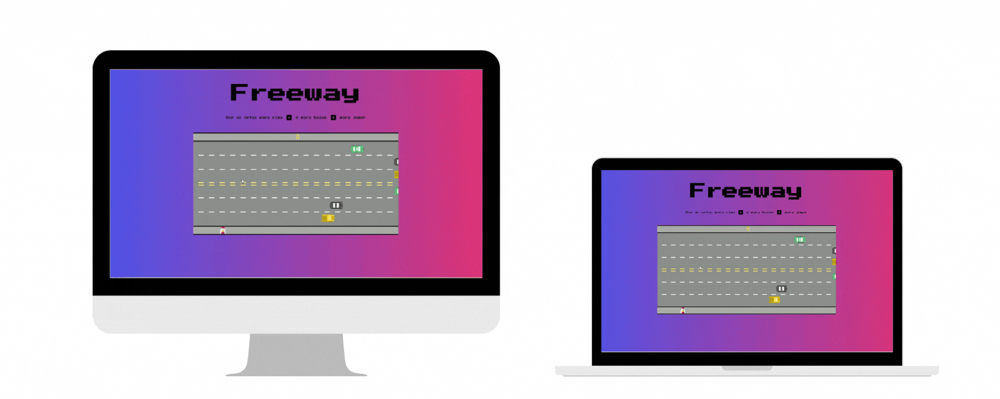

# FREEWAY GAME

This game is a reimagining of Atari's Freeway game.

It was a project from one of Alura's Programming Logic classes

⚒️ Technologies used:

- HTML
- CSS
- JavaScrip

📄 Requirements:

- Any operating system
- VS Code
- Chrome
- Desktop only

📝 License:

-Free for use and change

💻 Result:

